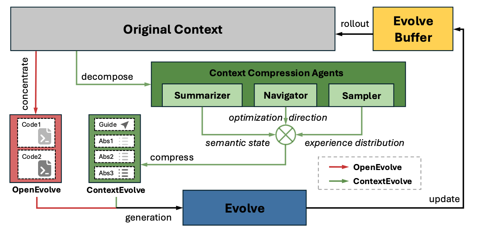
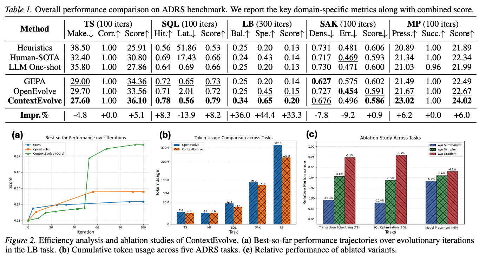

# ContextEvolve on ADRS: Multi-Agent Context Compression for Systems Code Optimization

ContextEvolve is a **multi-agent, training-free optimization framework** that discovers high-performance systems code under **API-only** LLM access. It is evaluated on the **ADRS benchmark**, which contains five challenging systems optimization tasks.

---

## Method Overview
### Multi-Agent Architecture


ContextEvolve decomposes the optimization context into three orthogonal dimensions, each handled by a specialized agent:

- **Summarizer Agent**  
  - Compresses code + logs into high-density natural language summaries.  
  - Plays the role of **state representation** in RL.

- **Navigator Agent**  
  - Analyzes multi-round trajectories and produces textual “gradients”, describing *what changed* and *how it affected metrics*.  
  - Analogous to **policy gradient estimation**.

- **Sampler Agent**  
  - Maintains a diverse, high-value experience buffer and selects exemplars for few-shot prompts.  
  - Implements **prioritized experience replay** in text space.

Together they form a **functional isomorphism** to RL (state → gradient → replay), but operate entirely via prompt construction, without modifying LLM weights.

## Results


- **Performance**:  
  Across all 5 ADRS tasks, ContextEvolve achieves on average **~33.3% higher final score** than prior state-of-the-art training-free baselines, while also outperforming pure prompt engineering and standard evolutionary coding agents.

- **Token Efficiency**:  
  Via multi-agent context compression, ContextEvolve reduces token consumption by **~29%**, even though it maintains richer long-horizon information (semantic states, directional feedback, curated exemplars).

## Implementation

Each ADRS task lives under:

ADRS/openevolve/examples/ADRS/<task_name>/For example:

- **EPLB (Load Balancing)**:  
  `ADRS/openevolve/examples/ADRS/eplb/`
- **Sparse Attention (SAK)**:  
  `ADRS/openevolve/examples/ADRS/sparse_attention/`
- **SQL Optimization (SQL)**:  
  `ADRS/openevolve/examples/ADRS/llm_sql/`
- **Model Placement (PRISM)**:  
  `ADRS/openevolve/examples/ADRS/prism/`
- **Transaction Scheduling (TS)**:  
  `ADRS/openevolve/examples/ADRS/txn_scheduling/`

Each directory typically contains:

- `config.yaml` – OpenEvolve configuration (LLM models, budgets, evaluator paths, etc.).
- `evaluator.py` – Task-specific evaluation logic (how to compute metrics).
- `initial_program.py` **or** a task-specific seed code file.
- `output/` – Logs, checkpoints, and best program artifacts from evolutionary runs.


A typical command looks like:

```bash
python openevolve-run.py ./openevolve/examples/ADRS/eplb/initial_program.py ./openevolve/examples/ADRS/eplb/evaluator.py --config ./openevolve/examples/ADRS/eplb/config.yaml --iterations 300
```